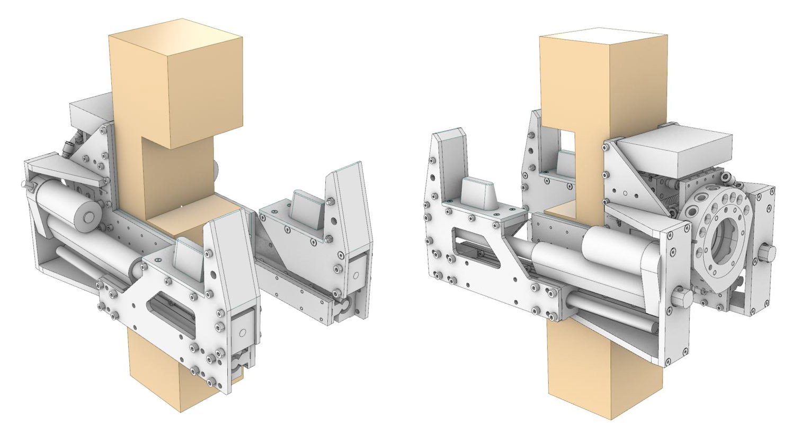
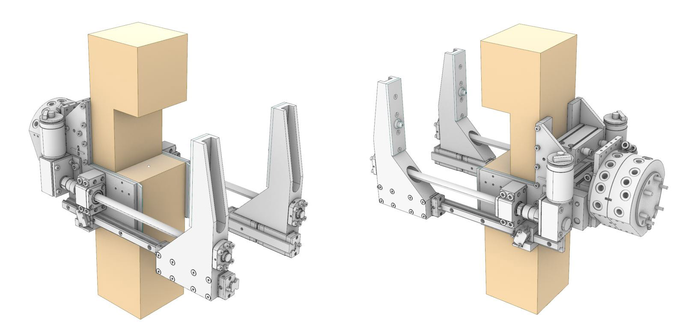
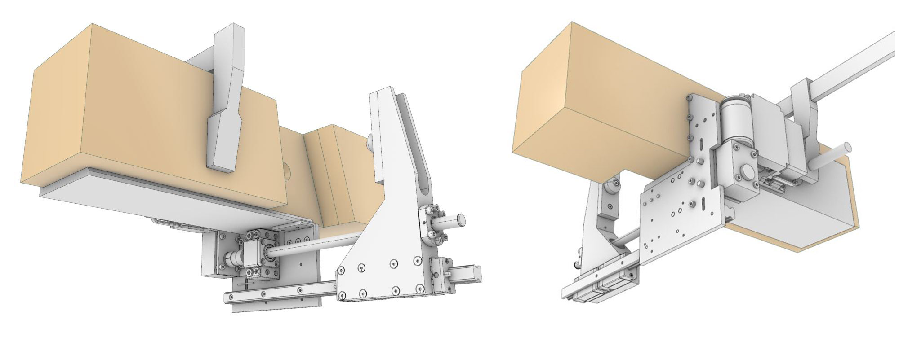

# clamp_hardware

Mechanical design for remote controlled robotic actuators. This includes various clamps and grippers. 

This repo is part of the [Robotic Assembled Timber Structures with Integral Timber Joints](https://github.com/gramaziokohler/phd_spatial_timber_assembly) project. 

## Repo folder structure

Mechanical design files (Rhino 3D files, production drawings), ordered by clamp and gripper types:

- **/clamps** - Robotic clamp design 
- **/grippers** - Robotic gripper design

Experiment setup (Rhino 3D files, photographs, writeup) including results and interpretation.

- **/experiments** - Physical tests constructed and performed to validate mechanical design.

## Design Goals

The mechanical design of the clamps is to be able to achieve the following functions: 

- Deliver high assembly force to assemble tight-fitting timber joints
- The clamps cannot relocate itself but rely on robotic manipulator (such as a robotic arm) for locomotion.
- The clamps can be temporarily attached to a timber beam and operate remotely.
- Different clamp designs accommodate different types of timber joints, some clamp design can accommodate a joint type with various angles.

## Clamp Design

### Clamp CL1

**Cross Lap Joint** Clamp for **Planar Orthogonal** joint angle. Timber section size 100mm x 100mm.

This is the first clamp prototype with off-the-shelf actuator and two jaw design. This proof-of-concept device successfully performed a single joint assembly task. 

This prototype exposed the limitation of off-the-self linear actuators which were designed to deliver push force, not pull force. 

- Maximum assembly force ~400kgf.
- Robotic quick changer integrated but not tested
- No remote control capability
- Linear actuator gear box housing failed during stress test

### Clamp CL2

**Cross Lap Joint** Clamp for **Planar Orthogonal** joint angle. (similar to CL1)

This clamp is an improved version from **CL1** with similar design goals and capability. The main modification is the development of a **single piece jaw design** by combining linear guide mount and ball nut mount into a single piece of milled aluminum. This jaw design is the result of two important experiments mentioned in the next section.

Notable improvements:

- Reliable power transfer mechanism
- Reliable DC Encoder motor
- Lighter weight than CL1
- Modular jaw construction

This clamp was designed and materials were prepared but were never assembled for testing. The materials was then used to create TL1 for the Tokyo project. Since the tests performed with TL1 was successful and the 

### Clamp TL1 (tokyo)

**Tee Lap Joint** Clamp for **Planar Variable** joint angle. Timber section size 120mm x 120mm.

This clamp is designed specifically for the GKR Tokyo Pavilion project with revised linear actuator design using ball screw and encoder DC motor. It has one clamp jaw that presses on the middle of the lap joint.

Two units of this clamp was created and two experiments were performed on assembling timber beams in during the Tokyo project. 

- No robotic quick changer integration
- Remote control and battery operation tested
- Two way synchronization not tested

Notable mechanical features:

- Single piece jaw design (combining linear guide mount and ball nut mount)
- Highly reliable worm-geared DC motor with dual channel encoder
- Small number of custom-piece

### Clamp CL3

**Cross Lap Joint** Clamp for **Planar Variable** joint angle. 

This clamp is a continuation of the single piece jaw design originated from CL2 and tested in TL1. This clamp is currently in development.

Battery Compartment Size: 82(L) x 37(W) x 46(H)

## Validation Experiments

[**Ball Screw Actuation Experiment**](./experiments/190910_Screw_And_Motor_Test) - After the failure of the prototype clamp CL1 with integrated linear actuator, the decision is to construct the linear actuation from ball screw and motor from parts. This test validate the selection of ball screw and motor by testing the pull force developed.

[**Linear Guide and Clamp Jaw Experiment**](./experiments/191111_Linear_Guide_Jaw_Test) - Learning from the experience of the prototype clamp CL1, the circular linear guide combination with linear actuator was insufficient to prevent small rotational movements. This experiment was devised to assess replacement with a rolling-ball linear guide and the corresponding clamp jaw design. The conclusion of this experiment leads to the development of the single-piece jaw design for clamp TL1 and CL2

[**Joint Press**](./experiments/200100_Joint_Press) - CNC controlled joint pressing machine to measure the tightness of a lap joint. (Device designed but not constructed)

[**Lap Joint Tightness vs Rotational Stiffness Experiment**](./experiments/191113_Joint_Tightness_Stiffness_Study) - Experiment to study the rotational stiffness of lap joints in relation to the tightness of the joint. Tightness is measured by the amount of assembly force used to assemble the joint. (Experiment planned but not performed due to budget constraint)

[**Hollow Screw Tightening Torque Measurement**](./experiments/200903_LucaScrewMeasurement)  - Experiment to study the tightening torque of Luca's hollow screw in wood. This allows gearbox and motor sizing for Clamp SL1 

Credits
-------------

This repository was created by Pok Yin Victor Leung <leung@arch.ethz.ch> [@yck011522 ](https://github.com/yck011522) at [@gramaziokohler](https://github.com/gramaziokohler)

