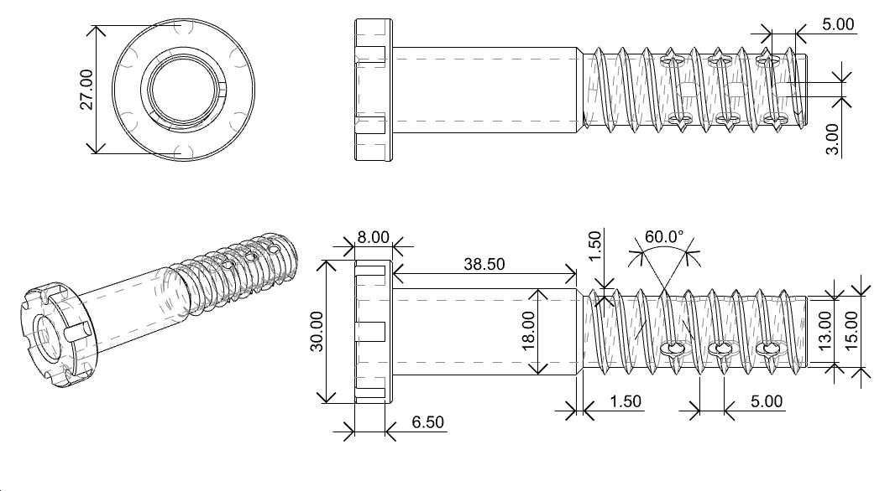
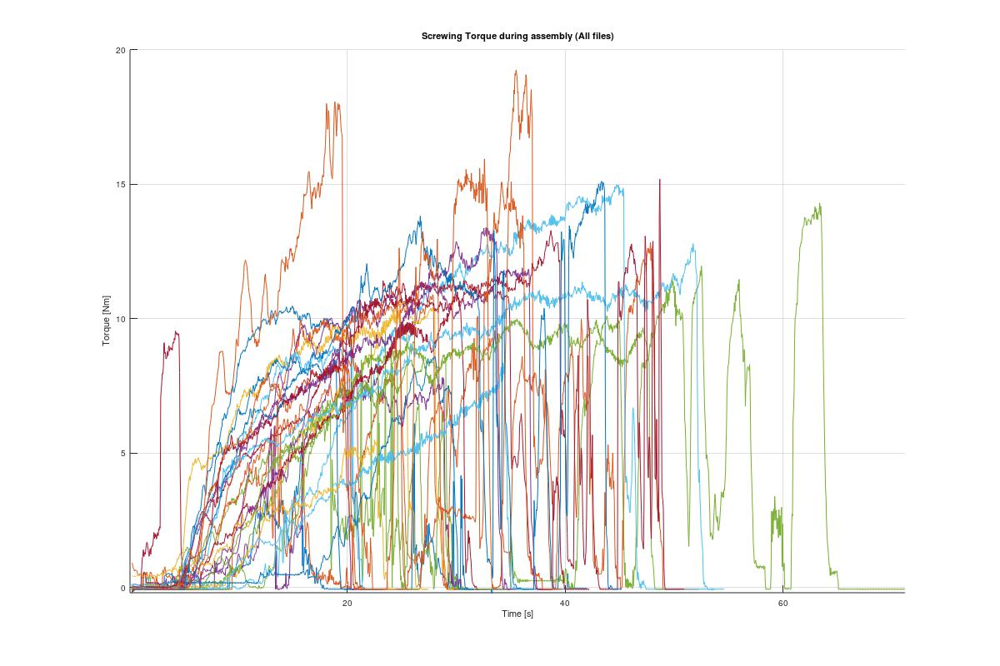
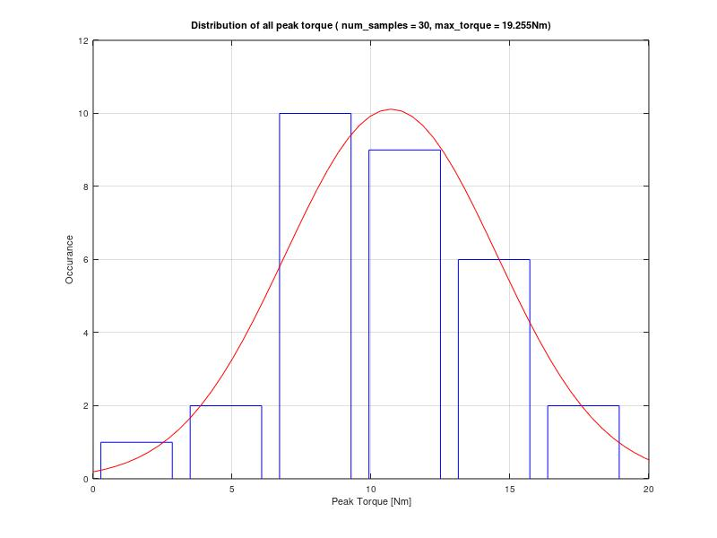
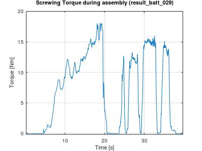

# Hollow Screw Tightening Torque Measurement

The goal of this measurement is to find the necessary torque need to tighten the hollow screw designed by Luca Steiner. The result will be used for sizing motor and gearbox for driving the screw.

## Test Setup

### Screw

### Wood

A short section of 100x100mm spruce wood with 15mm holes drilled at the center line.

### Torque measuring Device

The torque measuring setup consist of a jig that allows the wood sample to rotate and press against a 300kg load cell. 

The load cell is placed 50mm offset from the rotation center.

We used a Bosch battery drill with a custom adapter to rotate the screw. 

## Results

30 holes samples were measured and the maximum torque required is 19.25Nm.

The general trend is a higher torque required when the screw in deeper.

In cases where the rotation is stopped and restart, we do not observe a a higher peak needed to restart the motion.

## Next steps

Jamming might occur if the screw and the drilled hole is exactly the same diameter. Which in this experiment was 15mm. In production, 0.1 to 0.2mm diameter difference would prevent jamming.

If a shorter screw is used, the required torque could be lowered.